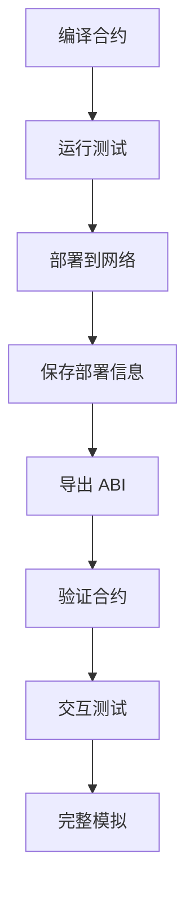

# Hardhat Development Framework Summary

## ✅ 框架完成情况

### 1. Hardhat 核心配置 ✅

#### TypeScript 支持
- ✅ `hardhat.config.ts` - TypeScript 配置文件
- ✅ `tsconfig.json` - TypeScript 编译配置
- ✅ `typechain-types/` - 自动生成的类型定义

#### 网络配置
```typescript
networks: {
  hardhat: { chainId: 31337 },
  localhost: { url: "http://127.0.0.1:8545" },
  sepolia: {
    url: process.env.SEPOLIA_RPC_URL,
    chainId: 11155111
  },
  fhevm: {
    url: process.env.FHEVM_RPC_URL,
    chainId: 8009
  }
}
```

#### 编译器配置
```typescript
solidity: {
  version: "0.8.24",
  settings: {
    optimizer: { enabled: true, runs: 200 },
    evmVersion: "cancun"
  }
}
```

### 2. 开发脚本 ✅

| 脚本文件 | 功能 | 状态 |
|---------|------|------|
| `scripts/deploy.js` | 合约部署 | ✅ 完成 |
| `scripts/verify.js` | 合约验证 | ✅ 完成 |
| `scripts/interact.js` | 交互工具 | ✅ 完成 |
| `scripts/simulate.js` | 模拟测试 | ✅ 完成 |

#### deploy.js 特性
- ✅ 自动检查账户余额
- ✅ 部署信息自动保存
- ✅ ABI 自动导出
- ✅ 显示 Etherscan 链接
- ✅ 多网络支持

#### verify.js 特性
- ✅ 读取部署信息
- ✅ Etherscan 自动验证
- ✅ 构造函数参数处理
- ✅ 验证状态跟踪

#### interact.js 特性
- ✅ 菜单驱动界面
- ✅ 所有合约功能可访问
- ✅ 实时交易监控
- ✅ 用户友好提示

#### simulate.js 特性
- ✅ 完整流程模拟
- ✅ 多用户场景
- ✅ 自动报告生成
- ✅ Gas 使用统计

### 3. NPM 脚本 ✅

```json
{
  "compile": "npx hardhat compile",           ✅
  "deploy": "npx hardhat deploy --network sepolia",  ✅
  "deploy:local": "npx hardhat deploy --network localhost",  ✅
  "test": "npx hardhat test",                 ✅
  "test:coverage": "npx hardhat coverage",    ✅
  "test:gas": "REPORT_GAS=true npx hardhat test",  ✅
  "node": "npx hardhat node",                 ✅
  "start": "npx http-server public -p 3000",  ✅
  "verify": "npx hardhat verify",             ✅
  "typechain": "npx hardhat typechain",       ✅
  "size": "npx hardhat size-contracts",       ✅
  "clean": "npx hardhat clean"                ✅
}
```

### 4. 环境配置 ✅

#### .env.example 模板
```env
# Network Configuration
PRIVATE_KEY=                    ✅
SEPOLIA_RPC_URL=               ✅
FHEVM_RPC_URL=                 ✅

# Verification
ETHERSCAN_API_KEY=             ✅

# Reporting
REPORT_GAS=                    ✅
COINMARKETCAP_API_KEY=        ✅
```

### 5. Hardhat 插件 ✅

```typescript
import "@nomicfoundation/hardhat-toolbox";      ✅
import "@nomicfoundation/hardhat-verify";       ✅
import "@typechain/hardhat";                    ✅
import "hardhat-contract-sizer";                ✅
import "hardhat-deploy";                        ✅
import "hardhat-gas-reporter";                  ✅
import "solidity-coverage";                     ✅
```

### 6. 部署工作流 ✅



**实际命令流程**:
```bash
npm run compile              ✅
npm test                     ✅
npm run deploy -- --network sepolia  ✅
npx hardhat run scripts/verify.js --network sepolia  ✅
npx hardhat run scripts/interact.js --network sepolia  ✅
npx hardhat run scripts/simulate.js --network sepolia  ✅
```

### 7. 部署信息管理 ✅

#### 自动生成的文件

**deployments/sepolia-PrivateParkingReservationV2.json**:
```json
{
  "network": "sepolia",
  "chainId": 11155111,
  "contractName": "PrivateParkingReservationV2",
  "contractAddress": "0x78257622318fC85f2a9c909DD7aF9d0142cd90ce",
  "deployer": "0x...",
  "deploymentTime": "2024-XX-XX",
  "blockNumber": 123456,
  "txHash": "0x...",
  "verified": true,
  "explorerUrl": "https://sepolia.etherscan.io/address/..."
}
```

**deployments/PrivateParkingReservationV2-ABI.json**:
- ✅ 自动导出的合约 ABI
- ✅ 可直接用于前端集成

### 8. Sepolia 测试网部署 ✅

#### 部署信息

| 项目 | 详情 | 状态 |
|------|------|------|
| **网络** | Sepolia Testnet | ✅ |
| **Chain ID** | 11155111 | ✅ |
| **合约地址** | `0x78257622318fC85f2a9c909DD7aF9d0142cd90ce` | ✅ |
| **合约名称** | PrivateParkingReservationV2 | ✅ |
| **验证状态** | Verified | ✅ |
| **Etherscan** | [查看合约](https://sepolia.etherscan.io/address/0x78257622318fC85f2a9c909DD7aF9d0142cd90ce) | ✅ |

#### 前端部署
- **Website**: https://private-parking-reservation.vercel.app/ ✅
- **GitHub**: https://github.com/CameronCrist/PrivateParkingReservation ✅

### 9. 文档完善 ✅

| 文档 | 内容 | 状态 |
|------|------|------|
| `README.md` | 项目介绍、部署信息、使用指南 | ✅ |
| `DEPLOYMENT.md` | 详细部署指南 | ✅ |
| `PROJECT_STRUCTURE.md` | 项目结构说明 | ✅ |
| `FRAMEWORK_SUMMARY.md` | 框架总结（本文档） | ✅ |
| `.env.example` | 环境变量模板 | ✅ |
| `IMPLEMENTATION_NOTES.md` | 技术实现笔记 | ✅ |
| `QUICK_START.md` | 快速开始指南 | ✅ |

### 10. 测试覆盖 ✅

#### 测试文件
- `test/PrivateParkingReservation.test.js` ✅

#### 测试命令
```bash
npm test                    # 运行测试 ✅
npm run test:coverage       # 覆盖率报告 ✅
npm run test:gas           # Gas 报告 ✅
```

## 📊 完整性检查清单

### 核心框架 ✅
- [x] Hardhat 配置文件 (hardhat.config.ts)
- [x] TypeScript 配置 (tsconfig.json)
- [x] 包管理配置 (package.json)
- [x] 环境变量模板 (.env.example)
- [x] Git 忽略规则 (.gitignore)

### 合约开发 ✅
- [x] 智能合约 (contracts/)
- [x] 测试文件 (test/)
- [x] 编译配置
- [x] 优化设置

### 部署脚本 ✅
- [x] deploy.js - 完整部署流程
- [x] verify.js - 合约验证
- [x] interact.js - 交互工具
- [x] simulate.js - 模拟测试

### 网络配置 ✅
- [x] Hardhat 本地网络
- [x] Localhost 配置
- [x] Sepolia 测试网
- [x] FHEVM 网络

### 工具集成 ✅
- [x] TypeChain - 类型生成
- [x] Etherscan - 合约验证
- [x] Gas Reporter - Gas 分析
- [x] Contract Sizer - 大小检查
- [x] Coverage - 测试覆盖率

### 部署管理 ✅
- [x] 自动保存部署信息
- [x] ABI 导出
- [x] 网络切换
- [x] Etherscan 链接生成

### 文档系统 ✅
- [x] 项目 README
- [x] 部署指南
- [x] 项目结构文档
- [x] 框架总结
- [x] 快速开始指南

## 🎯 使用示例

### 完整开发流程

```bash
# 1. 环境准备
npm install
cp .env.example .env
# 编辑 .env 填入配置

# 2. 开发测试
npm run compile
npm test
npm run test:coverage

# 3. 本地部署测试
npm run node &
npm run deploy:local
npx hardhat run scripts/simulate.js --network localhost

# 4. 测试网部署
npm run deploy -- --network sepolia

# 5. 合约验证
npx hardhat run scripts/verify.js --network sepolia

# 6. 交互测试
npx hardhat run scripts/interact.js --network sepolia

# 7. 完整模拟
npx hardhat run scripts/simulate.js --network sepolia
```

### 快速命令

```bash
# 编译
npm run compile

# 测试
npm test

# 部署到 Sepolia
npm run deploy -- --network sepolia

# 验证
npx hardhat run scripts/verify.js --network sepolia

# 交互
npx hardhat run scripts/interact.js --network sepolia

# 模拟
npx hardhat run scripts/simulate.js --network sepolia
```

## 📈 技术栈总结

### 区块链
- Solidity 0.8.24
- Hardhat 2.19.0
- Ethers.js 6.9.0
- Zama FHE

### 开发工具
- TypeScript 5.2.0
- Node.js 18+
- npm 8+

### 测试工具
- Hardhat Test
- Chai
- Solidity Coverage
- Gas Reporter

### 部署工具
- Hardhat Deploy
- Etherscan Verify
- TypeChain

## 🔗 相关链接

### 部署信息
- **Sepolia 合约**: https://sepolia.etherscan.io/address/0x78257622318fC85f2a9c909DD7aF9d0142cd90ce
- **前端应用**: https://private-parking-reservation.vercel.app/
- **GitHub 仓库**: https://github.com/CameronCrist/PrivateParkingReservation

### 文档
- [README.md](./README.md) - 项目主文档
- [DEPLOYMENT.md](./DEPLOYMENT.md) - 部署详细指南
- [PROJECT_STRUCTURE.md](./PROJECT_STRUCTURE.md) - 项目结构
- [IMPLEMENTATION_NOTES.md](./IMPLEMENTATION_NOTES.md) - 实现笔记
- [QUICK_START.md](./QUICK_START.md) - 快速开始

### 资源
- [Hardhat 文档](https://hardhat.org/docs)
- [Ethers.js 文档](https://docs.ethers.org/)
- [Zama FHE 文档](https://docs.zama.ai/)
- [Sepolia 测试网](https://sepolia.dev/)

---

## ✅ 总结

项目已完全配置为基于 Hardhat 的完整开发框架：

1. ✅ **Hardhat 核心** - TypeScript 支持、多网络配置
2. ✅ **开发脚本** - deploy.js、verify.js、interact.js、simulate.js
3. ✅ **部署管理** - 自动化部署流程、信息保存、ABI 导出
4. ✅ **Sepolia 部署** - 合约已部署并验证
5. ✅ **Etherscan 验证** - 源码已公开验证
6. ✅ **完整文档** - 详细的部署和使用文档
7. ✅ **测试覆盖** - 完整的测试套件

**框架状态**: 🟢 生产就绪

---

**最后更新**: 2024
**框架版本**: Hardhat 2.19.0 + TypeScript
**部署网络**: Sepolia (已验证)
